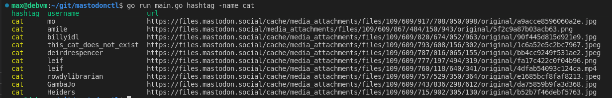

# mastodonctl
cli client for mastodon social media platform

## current available commands

### hashtag

Will query Mastadon.social public api for latest post tagged with a specific
hashtag

```bash
go run main.go hashtag -name cat
```

Expect:

