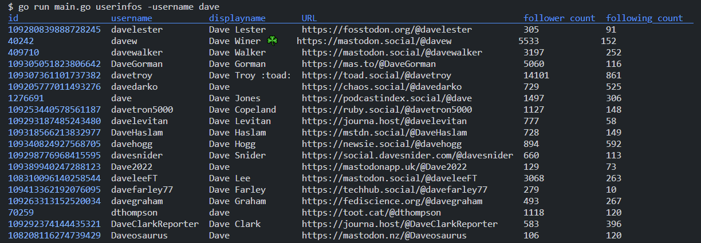

# mastodonctl

cli client for mastodon social media platform

## installation

since we don't provide pre-built binaries, having Go installed on your machine
is required. Follow this link: [https://go.dev/dl/](https://go.dev/dl/)

0. Clone repo to your local machine (fork repo if you intend to be a Contributor!)
    ```bash
    git clone https://github.com/socraticDevBlog/mastodonctl.git
    ```
1. Install project
    ```bash
    go install
    ```
2. Build project
    ```bash
    go build .
    ```
3. Add current project directory to your user PATH
  
    ```bash
    export PATH="$PATH:${GOPATH}/bin/mastodonctl"
    ```

4. (required) in order for the binary to be able to read configuration file
    ```bash
    current_directory=`pwd`
    export CONFIG_FILEPATH=${current_directory}/conf.json
    ```

`mastodonctl` is now available as CLI tool! 🚀

## configurations

As an experienced user, you may want to customize your commandline-tool.

This is possible by editing [`conf.json`](conf.json) file

### configurable values

| field               | description                                         |
| ------------------- | --------------------------------------------------- |
| ResultsDisplayCount | number of results displayed in your terminal        |
| ApiUrl              | URL of targetted mastodon server                    |
| AuthToken           | auth token required to interact with a server's API |

## current available commands

### userinfos

\* requires auth token for the server used

Will query Mastadon server's API for user infos based on their `username`


### suggested way to store private credentials

populate `AuthToken` field in [conf.json](conf.json) configuration file

⚠️ never commit `conf.json` file to `git` version control

## start working on local machine

try out a few commands to see if everything is working properly

### list users by username
```bash
go run . userinfos -username dave
```

Expect:



### hashtag

Will query Mastadon server's public API for latest post tagged with a specific hashtag

```bash
go run . hashtag -name cat
```

Expect:


## freely available Mastodon apps

- [mastovue](https://mastovue.glitch.me/#/vis.social/federated/duck)
- [mastoview](http://www.unmung.com/mastoview)

## my local Golang setup

* my `.profile` file
```bash
# golang configs
export GOPATH=$HOME/go
export PATH="$GOPATH/bin:$PATH"

# mastodonctl
# a valid conf.json file located beside mastodonctl binary
export CONFIG_FILEPATH="$GOPATH/bin/conf.json"
```